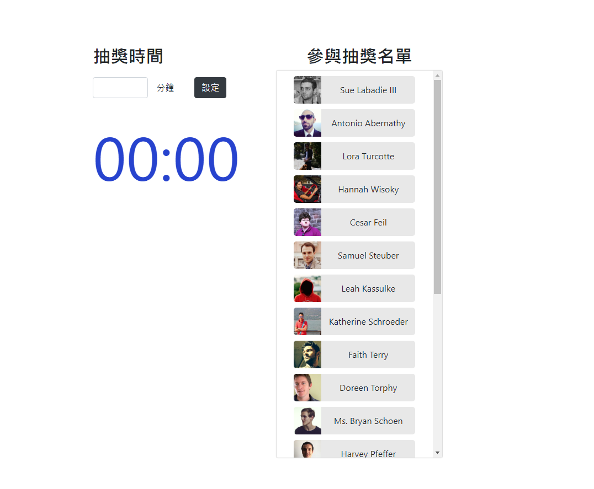

## Project purpose

this is a demo project for **lottery program** 

please download project by
```bash
git clone git@github.com:Jadson666/play-with-lottery.git
```
## Run on production mode


1. run `yarn serve` at root folder
2. then open [127.0.0.1:3000](http://127.0.0.1:3000) in your browser

## Run on dev mode (not recommended, prefetch will be disabled)
run `yarn watch`

---

## Demo

CodeSandbox: https://fe1r6.sse.codesandbox.io/

## Preview


